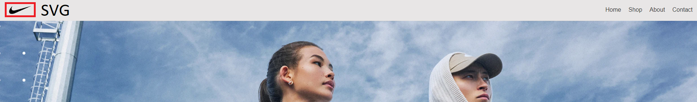
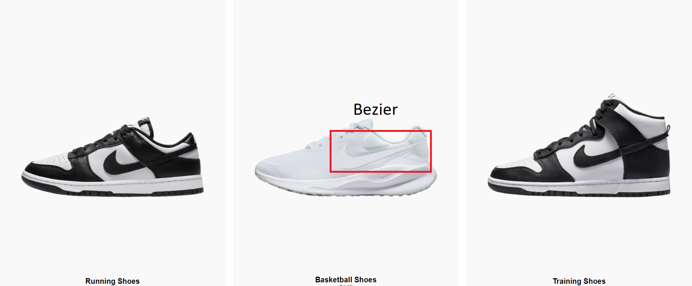

# Nike

Ustvaril sem spletno stran, ki je oblikovana po vzoru Nike-ove uradne strani, pri čemer sem uporabil HTML, CSS in JavaScript za celovito realizacijo. Z uporabo HTML-ja sem najprej postavil osnovno strukturo strani, vključno z navigacijo, hero sekcijo in produktnim prikazom, kar predstavlja temeljno ogrodje spletne strani.

CSS sem nato uporabil za skrbno oblikovanje vizualne plati strani, kjer sem se osredotočil na ustvarjanje moderne in estetsko dovršene postavitve, ki je prilagojena različnim zaslonom in napravam. S pomočjo medijskih poizvedb sem zagotovil, da je zasnova odzivna in uporabniško prijazna tako na namiznih kot tudi na mobilnih napravah, s čimer sem omogočil gladko uporabniško izkušnjo ne glede na velikost zaslona.

V JavaScriptu sem dodal funkcionalnosti, med katerimi izstopa uporaba funkcije bezierCurve, s katero sem ustvaril specifično obliko na elementu canvas. Ta canvas sem postavil neposredno čez originalno sliko Nike logotipa na čevljih, kar omogoča natančno prekrivanje logotipa z novo vizualno grafiko. S tem sem dosegel dinamično integracijo grafičnih elementov, ki so del spletne strani, in dodal interaktivni element nad obstoječo sliko.

## Funkionalnosti
- Prilagodljivost glede na rezolucijo,
- Bezier curve (canvas)

## Slike

